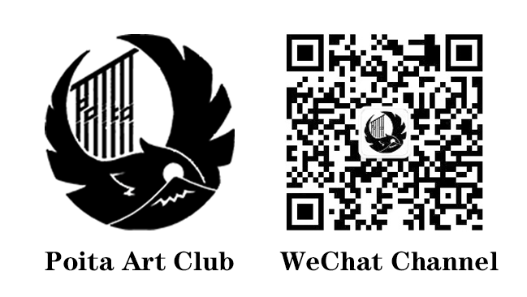

# PhiloCoffee / 哲咖 

Welcome to PhiloCoffee, where we explore the intersection of coffee and philosophy!

欢迎来到PhiloCoffee（哲咖），在这里，我们探索咖啡与哲学的交汇点！

## About Us / 关于我们

PhiloCoffee is based in Zhejiang University's Haining International Campus. We focus on exploring the crossroads of coffee and philosophy, finding insights through the shared experience of a delicious cup of coffee.

哲咖是一家坐落于浙江大学海宁国际校区的学生社团，我们专注于探索咖啡与哲学的交叉点。我们相信，在一杯美味的咖啡中，我们能够找到哲学的启示，并通过这种共享的体验，加深我们对生活和现实的理解。

### Our Mission / 我们的愿景

- Explore the connection between coffee and philosophy / 探索咖啡与哲学之间的联系
- Foster international exchange and academic discussions / 促进国际交流和学术讨论
- Encourage hands-on experiences with coffee brewing and philosophical debates / 鼓励咖啡冲泡和哲学辩论的实践体验

PhiloCoffee will provide an open, inclusive, and interactive platform to promote cultural exchange and academic discussions both within and outside the international campus. Our mission is to advocate the concept that 'philosophy should be part of daily life.' Through the everyday element of coffee, we lead club members to deeply understand and practice philosophy, applying its essence to daily life.

PhiloCoffee将提供一个开放、包容且互动的平台，促进国际校区内外的文化交流和学术探讨。我们的宗旨是倡导'生活中应有哲学'的观念，通过咖啡这一日常生活元素，带领社团成员深入理解并实践哲学，将其真谛应用到日常生活中。

We believe that from the beverage choices of philosophical masters like Kant, Voltaire, and Marx, we can gain insights into their pursuit of knowledge. For international friends on campus, coffee is not only a daily habit they grew up with but also a link to their culture. We encourage club members to participate in various activities such as philosophical salons, coffee tasting, and brewing, to enhance their practical skills while experiencing the collision and fusion of Eastern and Western philosophies through thinking and interaction.

我们相信，从康德，伏尔泰和马克思等哲学大师的饮品选择中，我们可以洞察其对知识的追求；而对于校园里的国际友人，咖啡则是他们从小长大的日常习惯，更是一种文化的链接。我们鼓励社团成员参与到各种活动中，如哲学沙龙、咖啡品鉴与制作等，通过这些活动提高他们的实践技能，同时让他们在思考和交流中感受到中西哲学的碰撞与融合。

<!--## Recent Activities / 近期活动
1. “你读了哪些有关咖啡和哲学的书？" ---在线文笔记录分享
社团可以定期写书摘推荐的活动彼此之间分享有趣的老书或新书，如果愿意以后可以彼此借书，写写画画，这样回到手中的书就承载着别人的思考，也是一种很好的社交

咖啡方向的技术书刊也鼓励分享，比方《咖啡年刊2022》，《世界咖啡地图》

> 关于哲学和咖啡的入门可以参考：《咖啡与哲学——对话体哲学导论》
这里是我写的[简单书评](https://github.com/PhiloCoffee/Philo_Chat/issues/5)，别的同学有兴趣也可以在issue里更新自己读的数目

投稿要求请见[readme.md](https://github.com/PhiloCoffee/Philo_Chat)-->

## Our Articles / 我们的文章

### phiosophy / 哲学部
- [爱咖啡的哲学家](philosophy/0807_爱咖啡的哲学家.md)：探索哲学家对咖啡的热爱以及其背后的深刻哲学涵义。
- [荐书: 《咖啡与哲学——对话体哲学导论》](philosophy/2023/0910_Book-咖啡与哲学.md): 一本从美国大学生视角出发的哲学入门书。在校园的咖啡馆内，三位不同专业的同学通过对话辩论，探讨了很多有意思而值得深思的议题，很适合哲学初学者阅读。
- [越南咖啡文化沙龙](philosophy/2024/0309_vietnam_coffee_salon/feedback.md)：咖啡与边界，一场哲咖社+模联社携手举办的咖啡分享会沙龙。
  - [Schedule](philosophy/2024/0309_vietnam_coffee_salon/content.md)：本次沙龙的提纲
- [ “哲咖+”探秘影视飓风：视听美学之旅  ](philosophy/2024/0316_MediaStorm/feedback.md): 本次iCareer企业走访活动从影视艺术的角度出发，探索背后的美学基础。通过实地探访，我们可以知道亿点点不一样这个频道如何克服艰难险阻，创造出一个个百万播放的精彩视频。欢迎一同感受科技与美学的碰撞，探索未知的可能。
  - [TODO](philosophy/2024/0316_MediaStorm/essay.md): 活动感想
  - [TODO](philosophy/2024/0316_MediaStorm/video.md)：我们社团推荐的一系列影视飓风的视频
#### Movie Night / 电影夜
经Prof. Robert Holmes 教授指导的电影夜活动，与Poita Art Club 合作，将作为本社的月度性常驻活动。
- [Suzeme](philosophy/2023/1006_Suzume.md): Poita Club的观影活动，一同欣赏顶级音画效果
- [Tenet信条](philosophy/2023/1022_Tenet_Review.md): 冷萃咖啡，卷积和诺兰的科幻狂想作品。

### coffee /咖啡部
- [咖啡的历史起源](coffee/0807_咖啡的历史起源.md)：一篇深入探讨咖啡起源和演变历程的文章，完美融合了历史和文化分析。
- [2023/11/26 社团文化节](coffee/1126_club_festival.md): 我们社团参加了海宁校区今年的社团文化节，为大家提供免费冷萃和塔罗占卜服务~
- [2023/12/20 考研加油挂耳活动与咖啡部会员卡](coffee/1220_Coffee_Card.md): 为了支持正在努力备考的同学们，我们联合组织了一次考研挂耳咖啡赠送活动。这次活动旨在为正在图书馆奋斗的朋友们提供必要的咖啡支持。
- [2024/02/02 "哲咖+"第一站——上海](coffee/0202_x_verge.md): 这次我们去了多伦路的X-verge咖啡店——特调、珠宝、以及其折射出的市民精致生活。
- [2024/02/20 "哲咖+"第二站——深圳](coffee/2024/0220_Shenzhen/feedback.md): 我们前往八卦岭， 了解独立咖啡馆的经营理念和深圳特色的精品咖啡。

#### coffeeshop tour / 探店纪实
- [T Cafe&Bar](philosophy/1005_CoffeeShopTour.md):A Day of Insightful Chat and Delightful Brews!
- [Aristotle-武汉](coffee/1020_Aristotle.md): 武汉的一家古希腊哲学主题咖啡厅~
- [2023杭州天目里咖啡节](coffee/1104_2023杭州天目里咖啡节.md): TODO 天目里探店活动！
- [ALL-IN 横头街店-海宁](coffee/1117_ALLIN_HENGTOU.md): 古香古色，海宁当地豆子最多的店！
- [越南Namphong咖啡店](coffee/2024/0214_vietnam_Namphong_cafe.md): 一家很棒的越南独立咖啡馆，在海防附近旅游的朋友可以看看~
### tech / 技术部
- [如何使用GitHub搭建并托管社团网站](tech/0807_如何搭建自己的社团网站.md)：一篇详细指导，让你了解如何使用GitHub Pages轻松搭建自己的社团网站。
- [如何使用GPT-4 based Dalle-3 一行生成社团海报](tech/1107_Poster_with_Dalle3.md): 一个展示SOTA 文生图技术的技术demo, 分析了部分我们社团海报的制作流程。
- [Best Practice for Club Email Management](tech/1105_Best Practice for Club Email Management.md):  分析了一些主流的免费邮件分发技术。
- [TODO](tech/0420_web_workshop/feedback.md): 几个社团负责人一起线下讲解如何运营社团网站及公众号。
  
## Our Activities / 我们的活动

**关键字：咖啡，哲学，社团，中西融合，国际交流，学术入门，文化沙龙**

- **Philosophy Salons**: Engage in deep discussions on various philosophical topics.
- **Coffee Making and Tastings**: Learn about different coffee varieties and brewing techniques.
- **Reading & Movie Seminar**: Through the lens of cultural philosophy, appreciate contemporary art and popular movies together, seeking deeper understandings and connections.
- **Collaborations**: Partner with other coffee shops and clubs to foster cultural exchange and shared learning.

活动形式包括但不限于：
- 哲学咖啡沙龙：这是我们的主打活动，我们会在此探讨各种哲学问题，并品尝与讨论主题相关的咖啡。例如，我们可能会探讨萨特的存在主义，同时品尝浓郁、苦涩的意式咖啡。
- 咖啡制作和品鉴：我们会邀请咖啡师来教大家如何制作各种咖啡，并进行咖啡品鉴。
- 社团读书会与观影会： 从文化哲学的角度，一同赏析当代艺术与流行电影。
- 与校园内的多家咖啡厅合作：我们希望与校内的咖啡厅合作，一起开展各种活动，推广咖啡文化。

***也欢迎你主动提出自己想参与的有意思的活动！***

## Our Mentor / 我们的导师
We are honored to announce that Professor SHAO KAI TSENG, a scholar with profound expertise in the field of philosophy, has agreed to become the mentor of our club.

我们很荣幸的宣布，曾绍恺教授, 一位在哲学领域有深厚造诣的学者，已经答应成为我们社团的指导老师。

## Collaboration Link / 合作链接

### 浙江大学学生咖啡社

> 共鉴咖啡文化，探索科研梦想 --- 创始人Cici

浙江大学学生咖啡社以***“健康饮用咖啡，普及咖啡文化，发扬中国咖啡”***为宗旨，依托**生工食品学院**，汇聚校内咖啡爱好者，传播咖啡知识与文化。社团活动丰富，线下举办咖啡分享会、精品课程、城市漫游计划等活动，一同分享品鉴好咖；线上开展风味云游计划、团购精品咖啡豆、制作咖啡节气签、普及咖啡“干货”，旨在推广咖啡知识，提供面向浙大师生和校友的咖啡交流平台；依托浙大强大的科研背景，社团希望通过深入研究食品营养与感官评价，以及跨学科的合作，为咖啡品鉴和学术研究注入新的活力。。

除此之外，浙江大学学生咖啡社想推动中国咖啡产业全过程的健康发展：

- **我们制作用户画像**，从了解程度到口味偏好，向所有人表达顾客的声音，希望由“你”来决定未来手中咖啡的味道和发展方向。

- **我们走访产地**，探访云南咖啡种植园、处理站、政府部门等等，希望将当地咖啡种植发展状况和咖农的真实想法和处境传递给外界。

- **我们和各位各位主理人交流探讨**，希望让他们的理念和想法为更多人所了解，让每一家店背后的故事成为一座城市宝贵的组成部分。

国内用三十年走了世界咖啡数百年的路，太多的内容文化需要消化和推广，我们想在这条路上尽一份自己的力量。

#### 公众号：求是咖啡社

### 浙江大学国际联合学院学生际辉POITA动漫美术社

> 很多事情其实很简单，比如艺术和生活。——Poita二代目

浙江大学国际联合学院学生际辉POITA动漫美术社创建于2018年，旨在于**生活中发现美，进行艺术创造与交流。**

POITA通过展开丰富的活动，如**参观艺术展、动漫配音大赛、线下观影、手工制作风筝、设计墙绘、交换艺术作品、环湖踏春**等，激发社员创作意趣，培养社员审美能力，提高艺术创作水平，同时也营造了校园艺术氛围，为浙大国际校区对动漫美术有兴趣的师生搭建了友好交流的平台。

在未来，POITA计划以**设计校园文化衫，统一参加漫展**等活动继续深化与传承社团文化、交流了解不同地域的艺术文化差异、定期开展观影观展等鉴赏类活动以提升艺术素养和丰富精神世界。

穆罕默德说：***“如果你有两块面包，你得用一块去换一朵水仙花。”***既然生活的*“面包”*已经富足，不如与POITA一起，让*“水仙花”*在漫漫人生旅途中馨香清雅、摇曳生姿。

#### 公众号：际辉POITA  

## Join Us / 加入我们

Interested in coffee, philosophy, or both? Join us and contribute to an energetic and inclusive community!

我们欢迎所有对咖啡和哲学感兴趣的学生加入我们的社团，无论你的专业是什么，无论你对咖啡和哲学的了解有多少，只要你对学习和分享感兴趣，你就是我们要找的人！

### 发送邮件即可加入：

如果你想加入我们，或者有任何问题，欢迎通过电子邮件：[jie.20@intl.zju.edu.cn](jie.20@intl.zju.edu.cn)或通过[GitHub issue](https://github.com/PhiloCoffee/PhiloCoffee.github.io/issues)联系我们。

[Contact Us: jie.20@intl.zju.edu.cn](jie.20@intl.zju.edu.cn) 

### 加入我们，你将能:
1. 亲自尝试半自动意式咖啡机， 从浓缩到拉花，制作专属于你的一杯拿铁。
2. Through the lens of cultural philosophy, appreciate art and movies together
3. 一同探店精品咖啡，参加杯测会，与专业咖啡师交流技术
4. Extend vision from Phil101 & Phil206, touring with Prof. Tseng again

The brewing process of hand-poured coffee has many similarities with tea preparation, offering us a unique perspective to integrate Chinese tea culture with Western coffee culture, showcasing the blend of Eastern and Western philosophies.

手冲咖啡的冲泡过程与茶的泡制有许多相似之处，这为我们提供了一个独特的视角，将中国的茶文化和西方的咖啡文化融合，通过这种融合展现中西哲学的交融。

We maintain close collaboration with the Zhejiang University Student Coffee Club (ZJU Coffee Club) at the Zijingang Campus and the Philosophy Club at UIUC University, exploring the transmission of coffee culture, learning from each other, and making collective progress. We look forward to every member who joins PhiloCoffee, working together to create a vibrant, inclusive, and intellectually stimulating club.

我们与浙大紫金港校区的浙江大学学生咖啡社（ZJU Coffee Club）和UIUC大学的Philosophy Club（哲学社）保持紧密合作，一起探讨咖啡文化的传递，互相学习，共同进步。我们期待每一个加入PhiloCoffee的成员，能共同创造一个充满活力，包容并充满智慧的社团。

---
“跟随古今哲人，洞悉世界之谜，共享智慧之光。”

"Share moments, taste life and explore wisdom”

“沉浸于咖啡的艺术，体验手冲之韵，共赏风味之美。”

**© 2023 PhiloCoffee Club / 哲咖**
