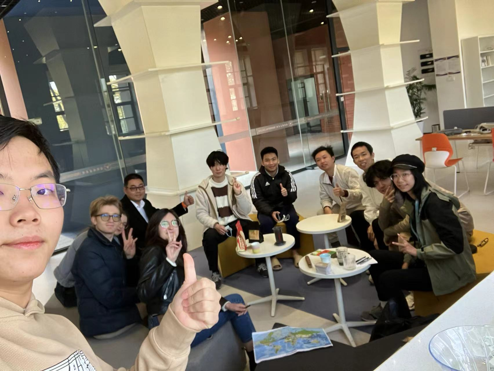
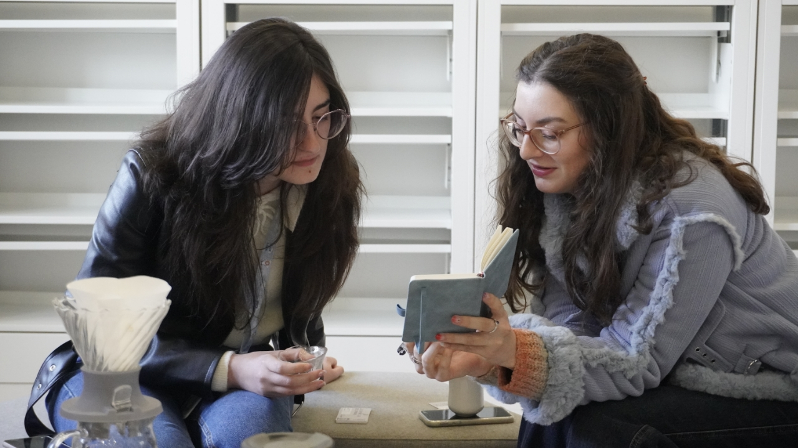
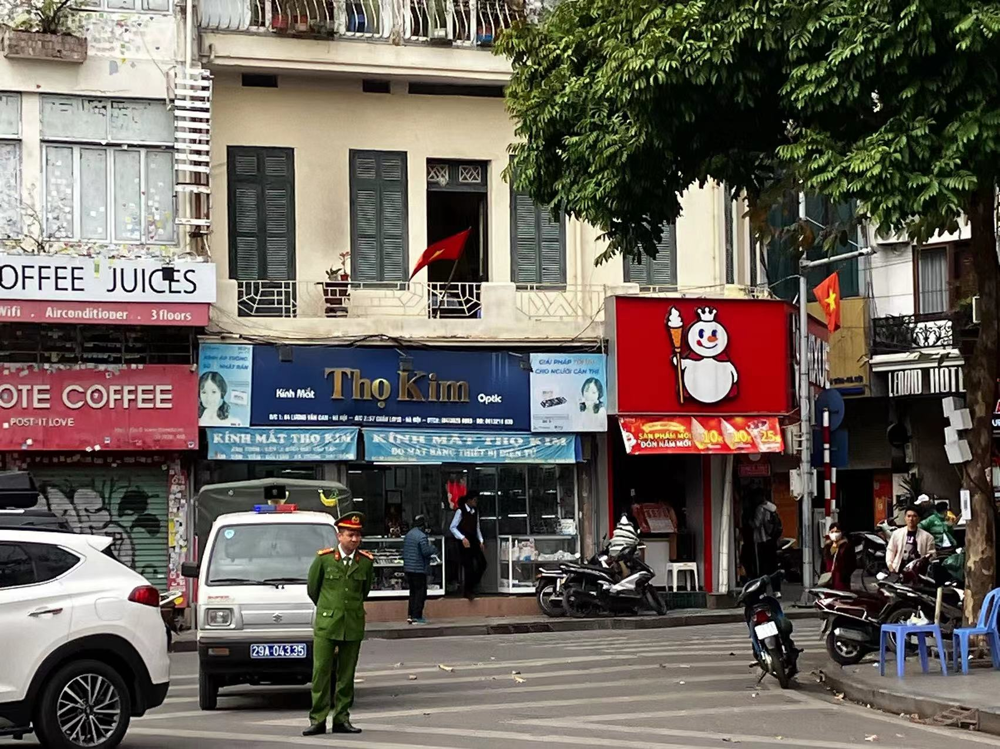
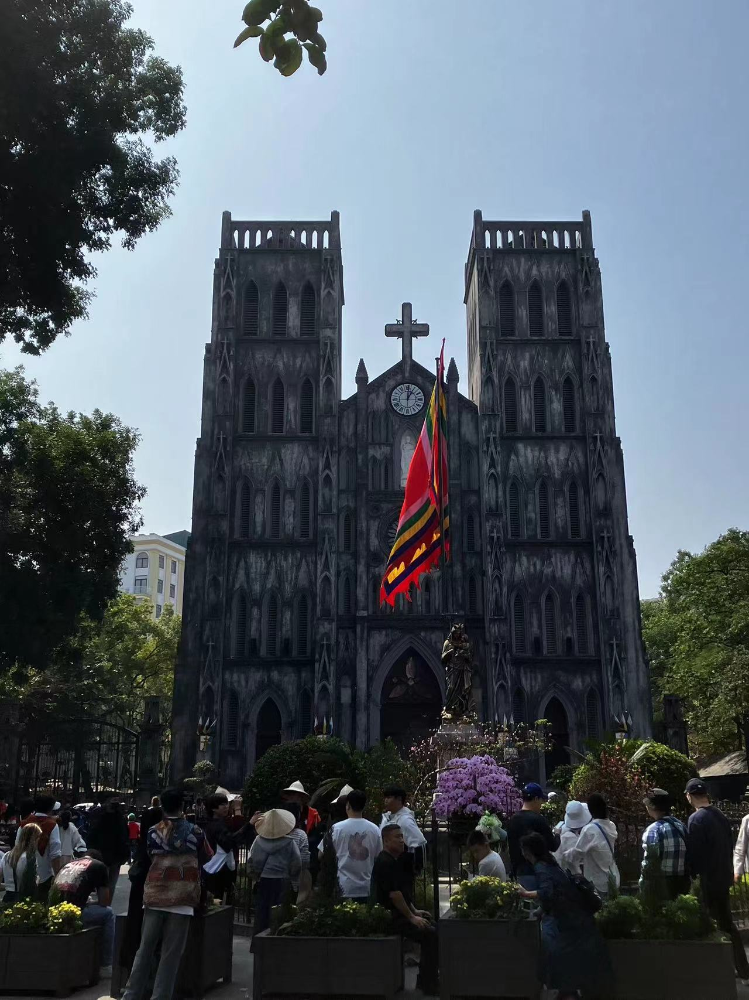
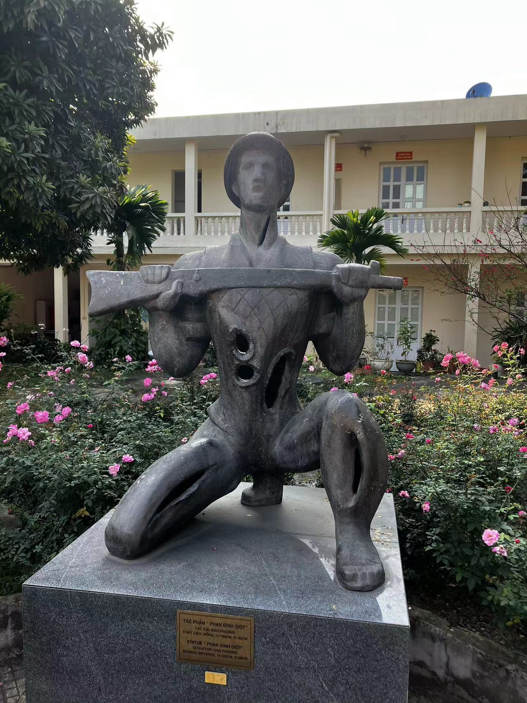
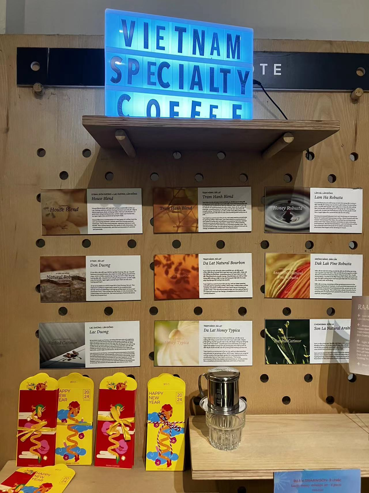
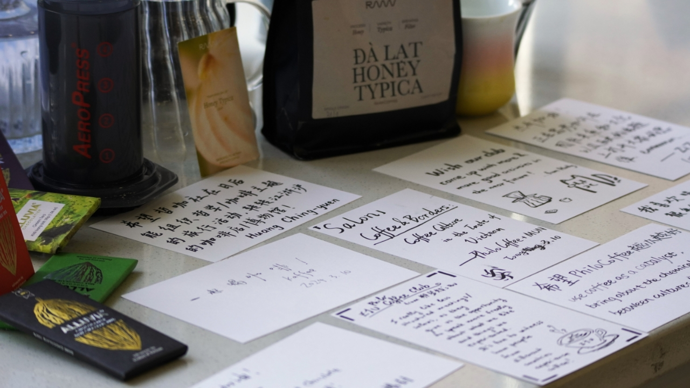
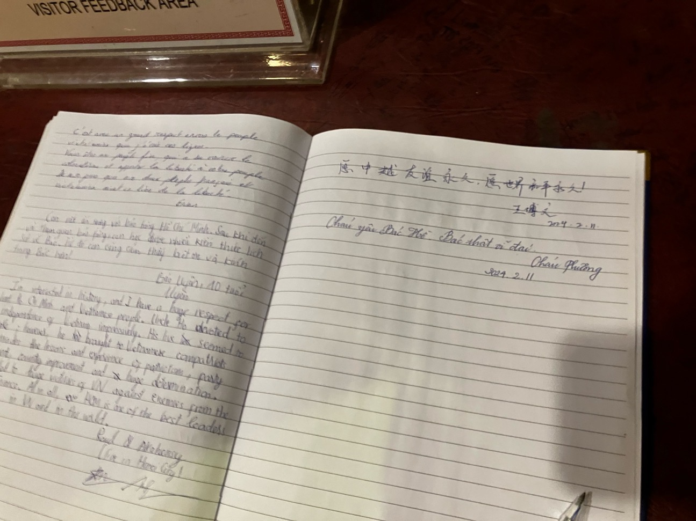
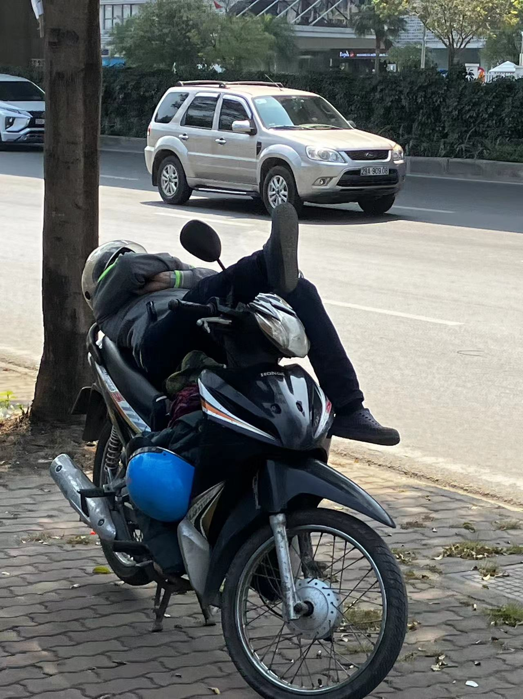

# 不是河粉 | Not Pho, But Bun
- 作者：William Tsu

- 责任编辑：Tony Wang

- 03/12/2024

  

​	SP24学期伊始，哲咖的第一场活动在三号书院的阅览室举行，主题是“咖啡与边界：越南味道中的咖啡文化”。在活动之前，我对越南的印象还局限于电视剧摩登家庭中的Lily。记得有一集里面，Lily的幼儿园同学跟Lily说自己的家长都是Italian，所以自己也是Italian。于是Lily认为自己的两个爸爸都是Gay，所以自己也是Gay。作为国际关系小白，我被“无需担心前置知识，沙龙旨在让每个人都能轻松加入讨论”的简介所吸引，带着对中越地缘政治的好奇，满怀期望地参加了活动。

​	与哲咖其他的活动一样，这次沙龙的国际化程度较高，参与者来自中越意三国。只见杰哥掏出一张世界地图，让大家一边mark自己的家乡一边自我介绍。作为连夜debug MP从而没睡好觉的ECE人，我被突如其来的自我介绍打了个猝不及防，只能尴尬地说，

> “My name is William and I come from Guangzhou. And … Emm … Oh, Guangzhou is the frontier of Reform and Opening Up in China!” 

好玩的是，模联社的社长半开玩笑地argue道：

> “I think the frontier is Shenzhen, not Guangzhou.”

 还好有作为深圳人的杰哥为我圆场，说

> “I think what he meant is ‘广州十三行,’ which has much longer history than Shenzhen.”

> 河内市中心的蜜雪冰城

​	伴随着轻松愉悦的 “price guessing” 环节，我们沙龙的沙龙正式开始。杰哥说，自己一家四口人在越南玩了一周，加上机票的开销却颇为廉价。这让我想起那个对我来说永远只存在于长辈们口中的，二三十年前的，同样物价低廉的中国，—— “不像现在。” 

与中国类似，越南也会庆祝春节。与当代中国不同之处在于，他们的店铺在大年初一都不营业——大家都要休息，没人跟你做生意。在我的印象里，儿时的广州也差不多这样——过年期间大家都回乡下了，城里反而空荡荡的。不过近年来，过年期间的广州似乎越来越热闹，因为越来越多年轻人倾向于把父母接到城里过年。今年春节我在广州也见到不少游客。但说实话，作为本地人，我实在难以想象，**“为什么有人会来广州旅游?”**

​	作为曾经的法国殖民地，越南当地留有许多哥特式建筑，比如河内市的中央教堂。这让我想起国内的许多西式建筑，比如广州的沙面，以及海宁的浙大 (bushi)。杰哥随即展示了更多展现殖民地历史的照片，在iPad上划出一张又一张照片。划着划着，划出一尊越南士兵的雕塑。士兵虽身中数弹，仍双手持枪、向前冲锋。于是，这张照片带出我们对中越共同抵抗美国侵略的讨论，勾连起我对自己参加过越南战争的小舅公的回忆。

​	

​	尽管有这么多相似之处，中越两国还是同中有异。还记得当杰哥展示越南米粉的时候，有人问，“这是米粉吗?” 越南的Cuong Tran同学特别认真地，用略显生涩的中文说，“bù是米粉!” 随后，他为我们详细解释了pho和bun的区别，让我们打开眼界。

> 越南当地的精品咖啡商家RAAW, 从豆子到烘培都是Made in  Vietnam

越南当地的咖啡也是风味十足，一杯 [RAAW](https://raaw.coffee/) 产的Honey Typica入口，ZZ觉得像梅子 [plum], 我觉得像是更甜的大红袍，也有人觉得像 “lemon + chocolate”。可见***“一千个品尝者，就有一千款手冲咖啡”。***

	

​	时间在一阵阵笑声中过得飞快，我们交换了彼此的旅行经历。春节期间，模联社的**鼠鼠**去了日本，意大利的Valentina她们则像ECE220 MP3中的DIJKSTRA算法一样，遍历了中国的大江南北—— 

>  “Xian, Chongqing, Chengdu … We went everywhere.” 

沙龙结束前，我们每人各写了一张cultural exchange card，留下我们对哲咖社的美好期望。

​	我在写完第一行“祝PhiloCoffee越办越好” 之后，深感自己汉字书写有愧于初高中语文老师的遵遵教诲，于是在第二行改用假冒的珠海一中体(衡水体在广东的变体)写下:

> “Use coffee as a catalyst, bring about the chemical reactions between cultures!”

这也是我一直以来对哲咖社存在主义的理解。

越南的社员亲切邀请大家前往越南旅游：

> "VIETNAM ---
> 	Country of wealthy culture and food,warming welcome every come and enjoy the best thing in here."
>
> --- Cuong Tran 陈雄强

愿中越友谊长存！

> 胡志明博物馆末尾的留言本上，中国游客的美好祝愿

附：

1. 杰哥在越南经常看到的人文风貌之一：

   

   越南人已经达至人车合一的境界了
