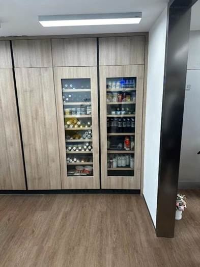
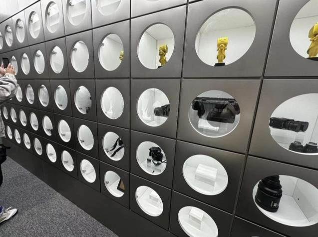

# 没有人能够拒绝一个好故事 / No one can resist a good story. 

- 2024年3月22日
- 作者：再来亿碗白米饭
- 责任编辑：Tony Wang

> 故事天然受到人类心智的关注，它能把所有信息包裹在故事中，一旦观众将自我与主角联系起来，怀疑就会消失不见。
>
> ​				--- 知名畅销书《故事》作者罗伯特·麦基

内容营销蔚然成风。讲好一个故事，成了无数创作者近乎工匠般的理想追求。但要问道：什么才是好的内容？如何量化讲故事的能力？——即便靠着经验主义和内容嗅觉，这仍是很难回答的问题。

> Stories naturally captivate the human mind. They can wrap all information within a narrative, and once the audience identifies themselves with the protagonist, skepticism vanishes.
>
> ​				--- Robert McKee, the renowned author of "Story"

Content marketing has become a trend. Telling a good story has become an almost artisanal ideal pursued by countless creators. But the question arises: What constitutes good content? How do we quantify storytelling ability?—Even with empiricism and a keen sense for content, this remains a difficult question to answer.

不过，在B站拥有四百多万粉丝的影视飓风UP主潘天鸿看来，通过“HKRR理论”，讲好故事从直觉走向了数据量化：快乐属性Happiness，知识属性Knowledge，共鸣属性Resonance，以及节奏感Rhythm，好的内容往往具备其中一项或多项。

创变者的领导力，在于使命和激发人的能量。从一个人讲好故事，到一群人讲好故事，潘天鸿究竟如何带领影视飓风一步步走向成熟，一步步无限进步的呢？他成功的背后有着什么样的秘诀？在这个阳春三月里，浙江大学海宁国际校区的师生们有幸来到Storm Base拜访参观，一探影视飓风的秘密与魅力。在这个阳春三月里，浙江大学海宁国际校区的师生们有幸来到Storm Base拜访参观，一探影视飓风的秘密与魅力。

However, for Pan Tianhong, a popular content creator on Bilibili with over four million followers, telling a good story has moved from intuition to data quantification through the "HKRR Theory": Happiness, Knowledge, Resonance, and Rhythm. Good content often features one or several of these attributes. From one person telling a good story to a group doing so, how exactly has Pan Tianhong led the team to maturity and continual improvement? What secrets lie behind his success?In this sunny March, students and faculty from Zhejiang University's Haining International Campus were fortunate to visit Storm Base, exploring the secrets and charm of their film production.

 

### 很开门的台球桌，上班娱乐两不误

### A billiards table allows for work and play without conflict.

### 可以看的出他们真的是在无限进步，满满一墙的百大UP奖状

It's evident they are continuously improving, as showed by a wall full of top creator awards.

 

## 感想 / Summary
经过这次走访，确实受益良多。我们感受到了影视飓风无限进步的活力，感受到了他们对影视行业无限的热情也感受到了他们对粉丝的真诚。

我们惊叹于他们年轻化弹性化的管理和办公理念，惊叹于他们和谐友善的合作氛围，惊叹于他们精益求精忠诚粉丝与客户的一腔热血。他们有着远大的理想，也许未来奥斯卡的小金人会为了他们换成小Tim。

十分感谢影视飓风对浙江大学本次的热情招待和耐心解答，祝愿影视飓风在以后的道路上越走越远。

***记得一键三连，谢谢！***

After this visit, we've learned much. We've seen the team's relentless progress, their passion for the film industry, and their sincerity towards fans. 

We're amazed by their youthful and flexible management, their friendly and cooperative atmosphere, and their sincere to fans and clients. They hold grand dreams, perhaps one day even winning an Oscar for Tim. 

We're grateful for the patient explanations from the team, and we wish them even greater success in their future endeavors. 

***Remember to like, share, and subscribe. Thank you!***

 

 

 

 

 