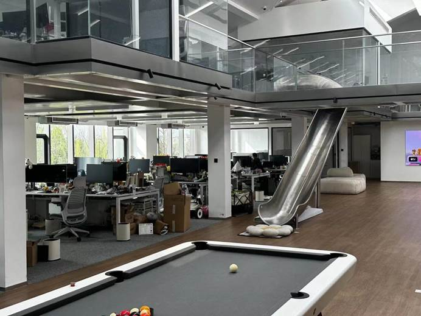

# 没有人能够拒绝一个好故事 / No one can resist a good story. 

- 2024年3月22日
- 作者：再来亿碗白米饭
- 责任编辑：Tony Wang

> 故事天然受到人类心智的关注，它能把所有信息包裹在故事中，一旦观众将自我与主角联系起来，怀疑就会消失不见。
>
> ​				--- 知名畅销书《故事》作者罗伯特·麦基

内容营销蔚然成风。讲好一个故事，成了无数创作者近乎工匠般的理想追求。但要问道：什么才是好的内容？如何量化讲故事的能力？——即便靠着经验主义和内容嗅觉，这仍是很难回答的问题。

> Stories naturally captivate the human mind. They can wrap all information within a narrative, and once the audience identifies themselves with the protagonist, skepticism vanishes.
>
> ​				--- Robert McKee, the renowned author of "Story"

Content marketing has become a trend. Telling a good story has become an almost artisanal ideal pursued by countless creators. But the question arises: What constitutes good content? How do we quantify storytelling ability?—Even with empiricism and a keen sense for content, this remains a difficult question to answer.

不过，在B站拥有四百多万粉丝的影视飓风UP主潘天鸿看来，通过“HKRR理论”，讲好故事从直觉走向了数据量化：快乐属性Happiness，知识属性Knowledge，共鸣属性Resonance，以及节奏感Rhythm，好的内容往往具备其中一项或多项。

创变者的领导力，在于使命和激发人的能量。从一个人讲好故事，到一群人讲好故事，潘天鸿究竟如何带领影视剧风一步步走向成熟，一步步无限进步的呢？他成功的背后有着什么样的秘诀？在这个阳春三月里，浙江大学海宁国际校区的师生们有幸来到Storm Base拜访参观，一探影视剧风的秘密与魅力。在这个阳春三月里，浙江大学海宁国际校区的师生们有幸来到Storm Base拜访参观，一探影视剧风的秘密与魅力。

However, for Pan Tianhong, a popular content creator on Bilibili with over four million followers, telling a good story has moved from intuition to data quantification through the "HKRR Theory": Happiness, Knowledge, Resonance, and Rhythm. Good content often features one or several of these attributes. From one person telling a good story to a group doing so, how exactly has Pan Tianhong led the team to maturity and continual improvement? What secrets lie behind his success?In this sunny March, students and faculty from Zhejiang University's Haining International Campus were fortunate to visit Storm Base, exploring the secrets and charm of their film production.

 

### 很开门的台球桌，上班娱乐两不误

### A billiards table allows for work and play without conflict.

### 可以看的出他们真的是在无限进步，满满一墙的百大UP奖状

It's evident they are continuously improving, as showed by a wall full of top creator awards.

 

## **QA Section**

### Q:可以看得出影视剧风制作的效率还是比较高的，同时几个账号都在更新。那么影视剧风制作一期视频大概需要多久?

A：我们制作一期普通视频大概是需要25天到35天左右，从策划到实拍到后期差不多这么长时间。普通视频包括商单和非商单这样，也会有一些特殊视频，比如Tim当时拍火山拍了一年，那这是属于特殊视频，是我们比较想做成功的和希望做的。

### Q: It seems that the production efficiency of the team is quite high, with several accounts being updated simultaneously. How long does it typically take to produce one video?

A: It usually takes about 25 to 35 days to produce a regular video, from planning to shooting to post-production. This includes both commercial and non-commercial videos.However some special projects may use longer time, like Tim spending a year filming a volcano, which is considered a special video we wanted to succeed in.

 

### Q：那你们会为了接商单想一些idea吗？

A: 不会的。我们会提前想好一些有意思的idea然后看有没有甲方爸爸喜欢的idea然后他就拿走。其实甲方是比较喜欢我们这种模式的。因为我们不仅为他们做了视频，其实也提供了投放的渠道。那我们在B站还是有一定基数的粉丝的嘛，那粉丝对我们是有一定忠诚度的嘛。所以宣传效果还是不错的。而像之前比亚迪发布会的我们是不投放的，发布会的视频一般是提前做好的嘛。

### Q: Do you brainstorm ideas specifically for commercial partnerships?

A: No. We brainstorm interesting ideas in advance and see if any clients like them enough to adopt. Clients actually prefer this approach because we not only create videos for them but also provide a propaganda channel. Having a solid fan base on Bilibili means our promotional efforts are quite effective. Unlike the BYD conference videos, we produce those in advance and will not publish on our account.

### Q：那我们的封面会换吗，我已经看了很多Tim不同的惊讶的表情了，以后封面会固定化吗？

A：其实我们对封面一直有换的想法，也就是没有这么满意吧，但一直没换出满意的版本。那何同学的封面就已经固定化了，但确实做的蛮好的。封面毕竟会影响点击率嘛，我们也没有做推流，我们觉得没有这个必要。那老观众不管封面怎样其实还会点的，那主要会影响新观众。

Q：其实老观众也关心的。

A：好的我们会关注的。

### Q: Will you change your video covers? I've seen many of Tim's surprised expressions.

A: We've been considering changing our covers but haven't found a satisfying replacement yet. For example, He Tongxue's covers have become standardized and are quite successful. Covers affect click-through rates Regular viewers will click regardless, but it mainly affects new viewers.

 

### Q：你们公司采用的使KPI绩效考核吗，感觉你们公司比较年轻化。

A:我们的公司性质其实决定了我们用不了KPI考核制度，毕竟KPI是给你一个目标然后你按照公司的规划猛猛干，挣了好几个小目标。那你说猛猛干也可能没法涨到目标的粉丝数。那拿亿点点不一样来看，那这个账号比如说要一年涨粉四十万，我们给了这个目标但没有给具体方法，这个是比较灵活的。这就是OKR制度。O是我们想要实现的目标，它通常是定性的，鼓舞人心的，要求通俗易懂，描述O时常以动词开头，实现、打造、推出。KR是我们为了达成O所需要完成的关键结果，它通常是定量的，要求符合SMART原则。方法上很灵活，所以我们每期视频不会说这个视频要涨多少粉，而是我怎么样把这个视频做好，做的吸引观众尤其是新观众。

### Q: Does your company use KPI performance assessments? It seems like a youthful company.

A: Our company's nature means we can't use KPI assessments. KPI set a target and you work hard to hit several small goals, but hard work might not always achieve the target fan count. Instead, we use the OKR system. O stands for our goals, which are usually qualitative and inspiring. KR represents the key results needed to achieve O, which are quantitative and follow the SMART principle. Our methods are flexible; we focus on making videos that attract particularly new viewers.

 

### Q：影视剧风招聘是怎么样的，待遇这么好我都想来上班当社畜了。

A：我们目前HR手上至少还有1600份简历吧，我们首先肯定是要看作品的。我们不是说在Boss直聘上发，而是在官网上发。因为做到现在我们已经很成熟了，那我们需要的是了解我们的人能快速跟上我们的节奏。那能找到我们的官网的必然是比较了解我们的，看过我们视频的。这算一个小门槛。然后就主要是看你的作品吧，作品是我们最关心的。然后会面试，我们面试问的问题都比较随机，但其实是有目的的，是想要了解你这个人的性格啊之类。那我们需要大量的合作嘛，那消耗团队的人我们是不会要的。然后来这里试用，我们一般不裁人，除非你跟不上节奏，那不好意思你只能下车了。我们还比较喜欢复合型人才，比如有位不愿透露姓名的大佬其实还会玩穿越机。

Q：这是让一个人打两份工吗？

A：那肯定不是。这样的我们钱肯定会多嘛。而且其实他一个人干多个角色的活其实提高了效率，省去了沟通的时间。

### Q: What's your recruitment process like? The benefits seem so good I'd consider working there.

A: We currently have at least 1600 resumes. We don't post on job sites but on our official website. Understanding our work and keeping up with our pace is crucial for new hires. Interviews are somewhat random but intentional, aimed at understanding the applicant's personality. We require a lot of collaboration, so we avoid hiring people who could drain the team's energy. We generally don't fire people unless they can't keep up. 

### Q:你认为Sora、Apple Vison pro这些新技术的出现会影响到你们的工作吗？

A:感觉没什么影响吧。毕竟现在还只是能起到一个辅助性的作用，其实从我们实拍的角度意义不大，因为你得人去调他，那对比真实的拍摄肯定是有很大的差距吧。那未来怎么样不好说，未来要是发展的不错那就再说。

###  Q: Do you think the emergence of Sora and Apple Vision Pro will affect your work?

A: Not really. They're mostly auxiliary for now and don't significantly impact our hands-on filming, given the difference from real shooting. The future might change, but we'll use it if it’s really useful.

 

 

### Q：你们会考虑多加点特效吗？

A:暂时没有这样的想法，毕竟我们是主要实拍，而且特效虽然炫酷像阿凡达这样，但他剧情其实一般般的。我们为你其实是想要一个打动人心的故事。而且特效方面对我们的盈利也没有太大的帮助，所以可能不会考虑。

### Q: Are you considering adding more special effects?

A: Not currently. We focus on real shooting, and while special effects like those in Avatar are cool, the storyline is quite average. We aim for a heartwarming story. Special effects don't significantly contribute to our profits, so it's unlikely we'll focus on them.

 

### Q：你们什么时候拍电影？(催更！)

A：一直有这个想法。Tim想在28年拿奥斯卡小金人，虽然时间有点赶啊，但梦想总要有嘛。那我们有一个短片组，Tim对他们期望一直很高，最近他们出差，所以断更了，他们更新周期比较长的，理解一下。那这个短片组就是来实现我们的梦想的，奥斯卡短片也是奥斯卡嘛。目前他们项目是亏损的，但我们其他的都盈利所以问题不大。就像刚刚说的我们想用一个真正感人的故事来打动观众，我们会一直进步的。

### Q: When will you make a movie? (PUSH!)

A: We've always had this dream. Tim hopes to win an Oscar by 2028, though it's a bit rushed. Dreams are essential, though. Our short film team has high expectations, and they've recently been on a business trip, hence the hiatus. Their project cycle is longer, but it's all in pursuit of our dream. Currently, the project is at a loss, but we're profitable elsewhere, so it's manageable. We aim to touch the audience with a truly moving story.

## 感想 / Summary
经过这次走访，确实受益良多。我们感受到了影视剧风无限进步的活力，感受到了他们对影视行业无限的热情也感受到了他们对粉丝的真诚。

我们惊叹于他们年轻化弹性化的管理和办公理念，惊叹于他们和谐友善的合作氛围，惊叹于他们精益求精忠诚粉丝与客户的一腔热血。他们有着远大的理想，也许未来奥斯卡的小金人会为了他们换成小Tim。

十分感谢影视剧风对浙江大学本次的热情招待和耐心解答，祝愿影视剧风在以后的道路上越走越远。

***记得一键三连，谢谢！***

After this visit, we've learned much. We've seen the team's relentless progress, their passion for the film industry, and their sincerity towards fans. 

We're amazed by their youthful and flexible management, their friendly and cooperative atmosphere, and their sincere to fans and clients. They hold grand dreams, perhaps one day even winning an Oscar for Tim. 

We're grateful for the patient explanations from the team, and we wish them even greater success in their future endeavors. 

***Remember to like, share, and subscribe. Thank you!***

 

 

 

 

 