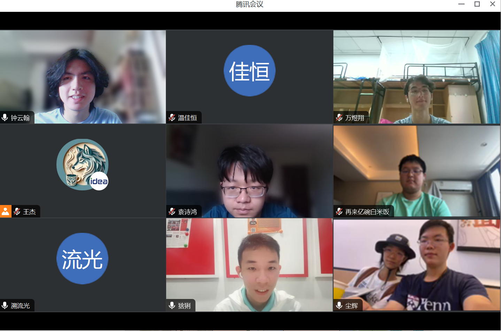
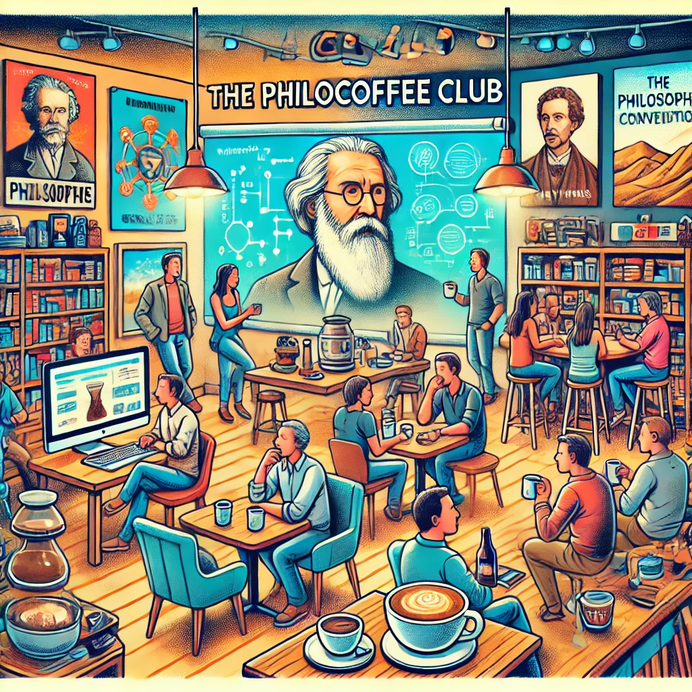

# PhiloCoffee Club's 2024 Leadership Transition

> Date: July 24, 2024
> Location: Online
> Written by: Zizi
> Edited by: Tony Wang

On July 21, we organized an online salon to elect a new core team for the club, mainly composed of 2023 undergraduates.

During the meeting, Tony asked the attendees a series of questions about club management and event organization to assess the new leadership team. Given our small international campus, the challenges we face are unique, requiring adaptive and flexible event organizaing capability.

Tony posed several common challenges in club management, such as:

1. How to balance personal time with club work?
2. How to meet the school's rigid requirements?
3. How to motivate member participation?
4. How to effectively handle leadership transitions?
5. How to manage internal conflicts and disagreements within the club?
6. How to manage the club’s finances and resources?
7. How to promote inter-departmental communication?
8. How to address issues with event venues and equipment?

Considering the new generation of PhiloCoffee’s core team is relatively inexperienced in event planning, Tony supplemented their answers with explanations and introduced potential collaborations with residential college and organizations. He suggested ways to collaborate with colleges, faculties, and other clubs and organizations in the future.

Two students’ answers were particularly impressive. ZYH mentioned wanting to create a more casual club atmosphere and activity format, where members could drop by for a coffee or a casual chat on weekends. WYX hoped the club’s activities could be more organized, perhaps by launching a series of events to build on and improve past activities.

Our club’s organizational structure is relatively flat, divided into four departments: Philosophy, Coffee, Technology, and Publicity. The roles within each department are not strictly defined, encouraging participation and discussion. With the new semester, we aim to recruit more members and host more interesting events, growing together with new members!

> Here is the new club members' division of labor:

| Member          | Position        |
| --------------- | --------------- |
| Zhong Yunhan    | President       |
| Xu Weili        | Vice President, Finance |
| Huang Kangqiao  | Philosophy Department |
| Wen Jiahang     | Coffee Department |
| Wan Yuxiang     | Technology Department |
| Yuan Shihong, Gao Ziyan | Publicity Department |

---

> Group photo!  
>
> 

### Reflections
Here are some excerpts of students’ reflections on the leadership transition:

> "Time flies so fast. Over the past year, I’ve become a regular at PhiloCoffee events. Looking back, as someone from Hangzhou, I attended all the PhiloCoffee+ events in Shanghai and Shenzhen. On weekends and after classes, I’ve lost count of how many cups of coffee I’ve enjoyed from Senior Jie. This transition meeting felt like Senior Jie’s final words of advice to family members about to set off on a journey (just kidding). A new academic year is ahead, let’s keep working hard!"
--- Zhong Yunhan (Zizi)

> "When I first joined the university, I was attracted by the clever combination of philosophy and coffee during club recruitment. Since then, I’ve participated in numerous fascinating tech salons, coffee shop visits, and cultural festivals organized by the club. In the conversational atmosphere of coffee, guided by philosophical theory, I’ve spent a year with PhiloCoffee, gaining experience and ready to contribute to its future development. During last Sunday’s leadership transition, under Tony’s guidance, we had a productive discussion on club development issues and prepared for our new roles. I’m honored to become the head of the Technology Department, aiming to bring more cutting-edge tech salons and practical skills sharing to everyone. I hope these exchanges will be beneficial to all."
--- Wan Yuxiang

> "Over the past year, from the first coffee shop visit to the subsequent AGI salons, I’ve developed a sense of belonging to PhiloCoffee. Especially Tony, with his innate charisma, always generously shares his valuable experience and encourages us to enjoy conversations with experts. This feeling transcends PhiloCoffee itself. Today, at Tony’s transition meeting, he explained potential future collaborations, ways to expand our audience, connect with ZJE and ZIBS, and organize events. We also shared our capabilities and divided our responsibilities, looking forward to creating more exciting and brilliant moments together in future collaborations."
--- Yuan Shihong

### Farewell Message from the Outgoing President

"*PhiloCoffee, what a strange combination!* This question has been asked many times during our club events. Philosophy and coffee, seemingly unrelated concepts, share a certain commonality in my view. Etymologically, 'Philosophy' in Greek means 'love of wisdom,' and since the Enlightenment, coffee has been the companion of philosophers, writers, and thinkers during their deep reflections and exchanges.

On the night of July 29, 2023, after a long conversation over coffee with Professor Zeng, I decided to seriously create an interesting club, aiming to shape a kind of idealism I envisioned.

In my ideal club, it wouldn't be a place for serious academic discussions but rather a lively, fun, and relaxed salon, preferably with a drink in hand. I don't expect members to identify a sunset as 'Kodachrome sky' like professional photographers, nor demand an untrained person to recognize a building’s Shiller-style roof on the street.

Appreciating beauty requires not just discovering it but also thinking about, discussing, and understanding it. Hence, in my year of experimentation, we organized a variety of activities: coffee shop visits, movie discussions, visits to filming locations, and even building our own "hand-brewed" coffee machine as a graduation project... These all echo what we first mentioned in the salon at T Cafe&Bar: **"To be is to perceive or to be perceived."** (George Berkeley). To perceive this beautiful world, we think, explore, and create. Pursuing a delicious and exquisite cup of coffee is to perceive the wisdom in coffee brewing; pursuing boundless technology is to perceive the wisdom in scientific research. Therefore, our club can have a wide range and long thoughts, as each of the thousand members may see PhiloCoffee differently. What remains unchanged is our pursuit of Philo and Coffee.

I believe the new leadership team will have their own thoughts and definitions. They, being sincere and humorous, will bring a different PhiloCoffee. As STEM students, we can do more than talk about technology; we can participate in it and build the future we hope for. In *PhiloCoffee+*, *PhiloTech*, we welcome everyone to join our activities. I look forward to seeing PhiloCoffee Club doing even better in the future!

--- Wang Jie, Tony Wang, PhiloCoffee President and Founder

### New President's Outlook for the New Academic Year
**by Zizi**

**Club Website Update**  
First, we plan to revamp the club website this academic year, making it more visually appealing and experimenting with new promotional formats such as public account articles.

**Local Activities**  
Next, we plan to conduct more activities in cooperation with the local Haining community, such as visiting more local coffee shops and participating in nearby coffee festivals.

**Activity Themes**  
Regarding events, we hope to organize a series of activities around certain themes, continuing the "PhiloCoffee+" model and spirit in our coffee shop visits, ensuring the depth and breadth of tech salons, and hosting more cultural sharing activities, such as sharing Italian culture and cuisine. Increasing cooperation with other departments during events is also crucial.

Additionally, in terms of club atmosphere, we aim to make it more casual than the previous year. Spending weekends enjoying a cup of coffee together can be a great way to connect.

Finally, we hope to recruit more interesting and thoughtful members, adding more vitality to our club.

