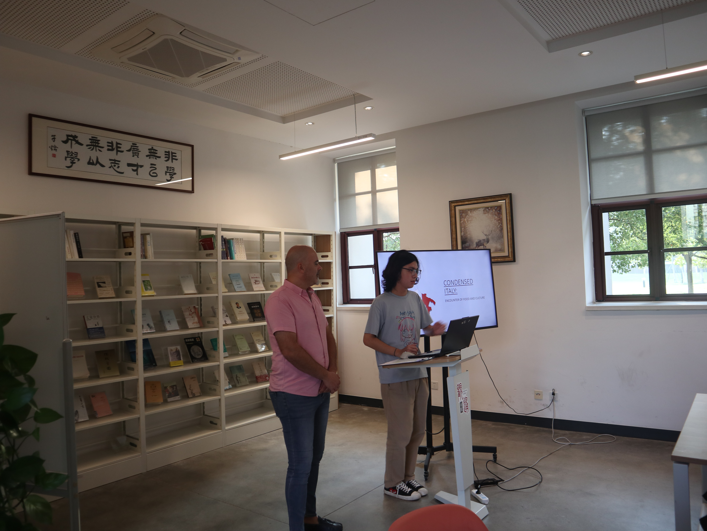
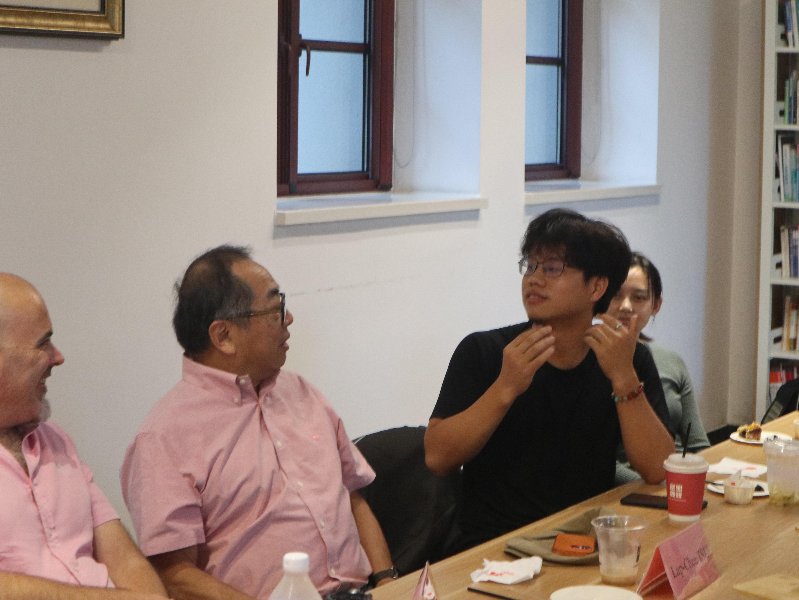
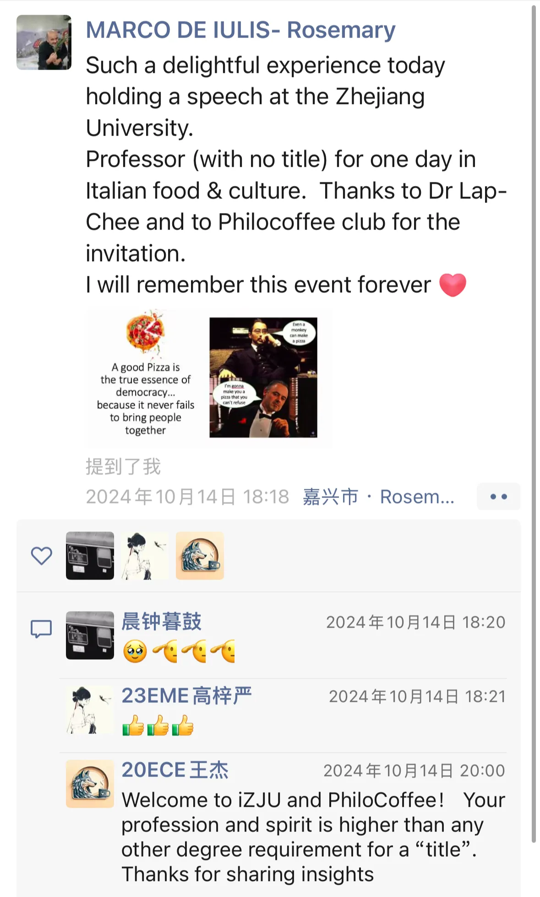

# Philocoffee + Rosemary “浓缩意大利”文化分享会

> Coffee Shop Tour Event
> 
> - 滋滋 & yuxiang
> - 14/10/2024

> 地点：浙江大学海宁国际校区观通书院讨论室
> 

---
## 嘉宾介绍与开场
本次分享会有幸邀请到了海宁Rosemary餐厅老板Marco先生和徐立之院长！Marco在海宁耕耘意大利餐厅事业多年，Rosemary早已成为海宁人中流芳已久的餐厅。笔者曾去过那里就餐两次，味道十分不错，绝对是正宗的意大利菜，就是定价有些高。徐院长目前担任国际校区的书院顾问，曾身为香港大学的第十四任校长，也为香港科学院的创院院长，在自己的学术生涯中周游各国，相信他对于各地文化的了解与自己独特的见解能为此次活动增添异彩！

> 哲咖社社长作为主持人致欢迎和介绍辞

## 一场因披萨而起的对话

Marco先生先介绍了一下他和徐立之先生第一次见面时的场景，徐院长来到他店里，对他说“Even a monkey can make a pizza!”，Marco闻言十分生气，但是他没有将徐院长赶出店，而是按照徐院长的要求尽自己所能做了一份披萨出来。而徐院长也没有继续刁难他，尝过披萨之后，便开始和Marco交流关于意大利文化和没事的看法。事后，Marco分享道“他在一开始如此刁难别人，其实也是徐先生测试别人性格和水平的一种方式。”

## 意大利美食之源

关于意大利美食形成的原因。Macro先生先向我们介绍了意大利的地理禀赋，相对较大的纬度跨度以及国土内部的不同地形赋予了当地丰富多样的物质产出，以及与之俱来的丰富烹饪食材。Diversity is all matters! 

同时从文化交流的视角来看，意大利独特的地理位置让其能够时刻吸收来自东西双方的文化交流成果以及烹饪技巧，进一步丰富了本土的美食文化。

## “慢”与“简”——意大利美食的哲学

之后Macro先生也介绍了意大利文化中十分重要的两个元素“Slow”和”Simple“。slow是一种生活态度，以上Macro展示的小摩托车在上世纪40年代就被大量使用了，但是事实上时至今日，你依旧能在意大利大街上处处看到这款小摩托！

Simple于何处体现呢？往往，意大利美食只需要简单的原料就能完成，比如玛格丽特披萨，只需要面饼，橄榄油，番茄，芝士，罗勒，搭配恰到好处的窑炉中的火候控制，就可做成。

---

## Q&A：从餐厅选址到定价策略

之后便是提问环节啦，笔者提了一个困扰了本人很久的问题：为什么Marco会将意大利餐厅开在海宁，而不是杭州或者上海。

Marco先生于是追溯起Rosemary的历史。很久以前，他在嘉兴和海宁做皮草相关的生意，但是他发现在海宁并没有任何正宗意大利餐厅。每周六他都得开车去上海购买意大利原产的食材，以便在家中做晚餐，时间久了便觉得有些不方便。而且他发现，海宁的外国人很少，即便有外国人来海宁，也多半是从上海来的，不会在海宁过夜，当天往返海宁上海。

之后他便萌生了开一家餐厅的想法，起初，Rosemary还是一个家庭餐厅，环境比较简陋，但是口碑很好，来海宁的外国人们口口相传，越来越多的外国人愿意来体验他的正宗意大利菜。

> btw，上文多次提到了正宗二字，这也正是marco的一贯坚持，所有原料都从意大利进口，招聘意大利厨师，得到意大利商会的认证。“原汁原味”是他的意大利餐厅和浙江99%的街头意大利餐厅最大的区别。事实上Roseamry是浙江为数不多得到认证的意大利餐厅（certified by the Italian Chamber of Commerce）。
> 

此后便有人抱怨他餐厅环境不好，和意大利菜优雅的氛围很不协调，于是他将店搬到了现在的地点（房租更高的地点），并且装修过了一遍。

这就是现在的Rosemary了。

---

徐院长也提了个问题：为什么他的餐厅卖的那么贵。

Marco笑了笑说，因为成本已经很高了，首先食材是意大利空运进口的，其次厨师时意大利人，第三，由于餐厅坐落于海宁市中心，刚刚说到了的店面的房租也很高。他现在已经在成本的基础上尽可能将售价降得比较低了。并且学生来他的餐厅中用餐他一贯都会慷慨的给出88折优惠。

在分享会最后，徐院长对同学们提出来他的愿景，他希望Marco先生的匠人精神能为同学们提供一个榜样，在今后的学习与生活中，也需要这样执着与专注的精神。

> 大合照！
> 

## 结语：美食与哲学的交汇

在这场充满意式风情的文化分享会中，我们不仅领略了意大利美食的丰富与精髓，更在故事与交流间感受到文化交融的魅力。Marco先生的坚持，让我们看到匠人精神如何塑造一份美味，也让我们思考：什么才是“正宗”？是食材的来源？是技艺的传承？还是那份对品质的不妥协？

徐院长的一番话更是点醒了我们——在学习与生活的道路上，我们是否也能像Marco先生一样，执着于自己的热爱，不因环境的局限而妥协，不因现实的压力而放弃？美食的意义不仅仅在于味蕾的享受，它同样承载着人生哲学：慢下来，去感受食材本身的纯粹；专注于细节，方能成就不凡。

PhiloCoffee哲咖社一直在探索哲学与生活的交汇点，而咖啡、食物，乃至每一次思想的碰撞，都是我们理解世界的一扇窗。文化的交流不只是知识的传递，更是彼此灵魂的触碰。期待下一次的相聚，我们依旧在一杯咖啡、一道美食、一场思想的盛宴中，继续思考，继续前行。

---

> 彩蛋：笔者送别Marco先生之后，他于当天在朋友圈中分享了今天的故事。
> 

