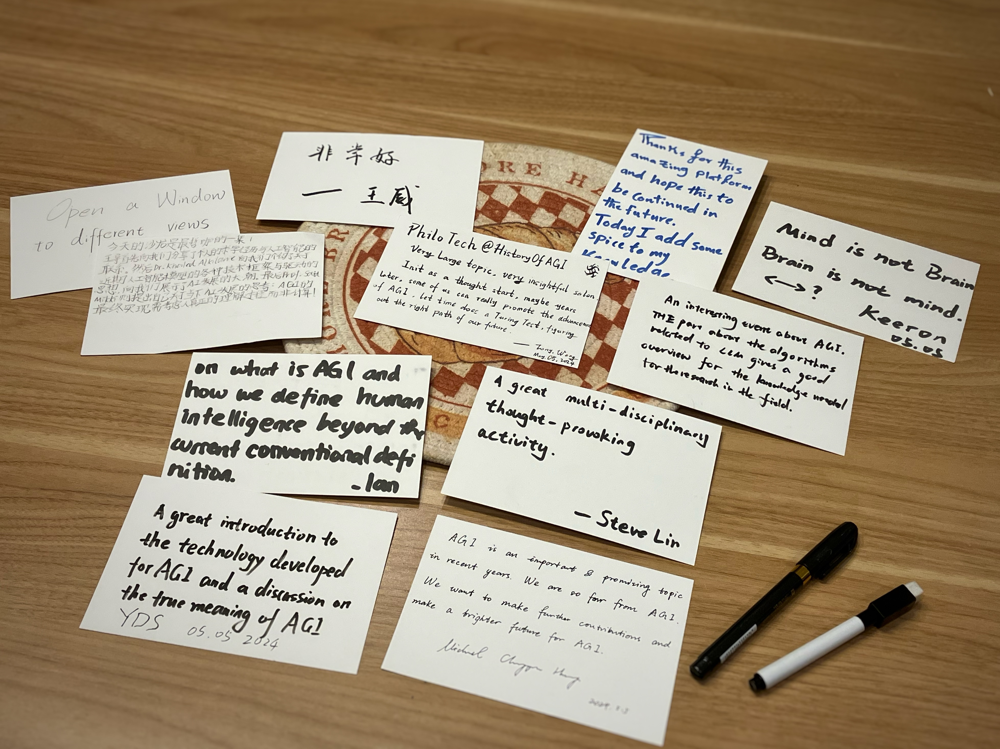
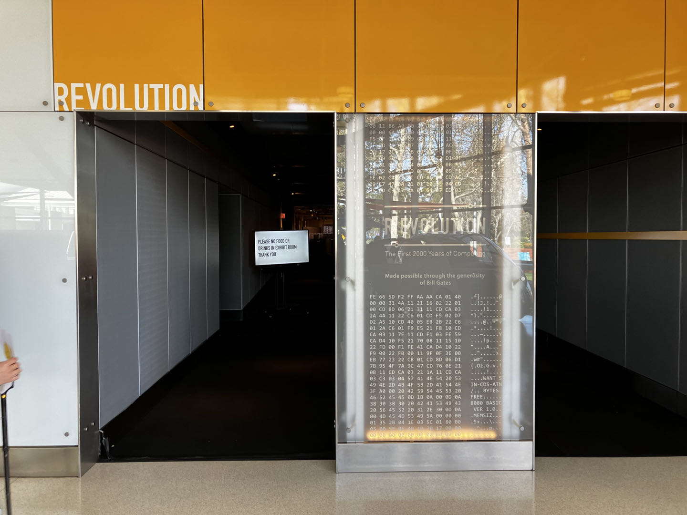
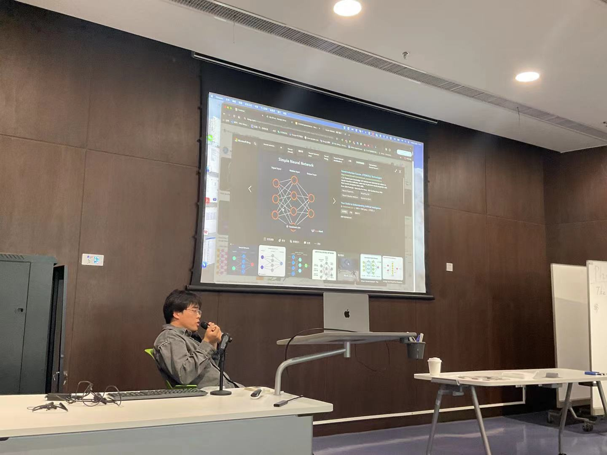
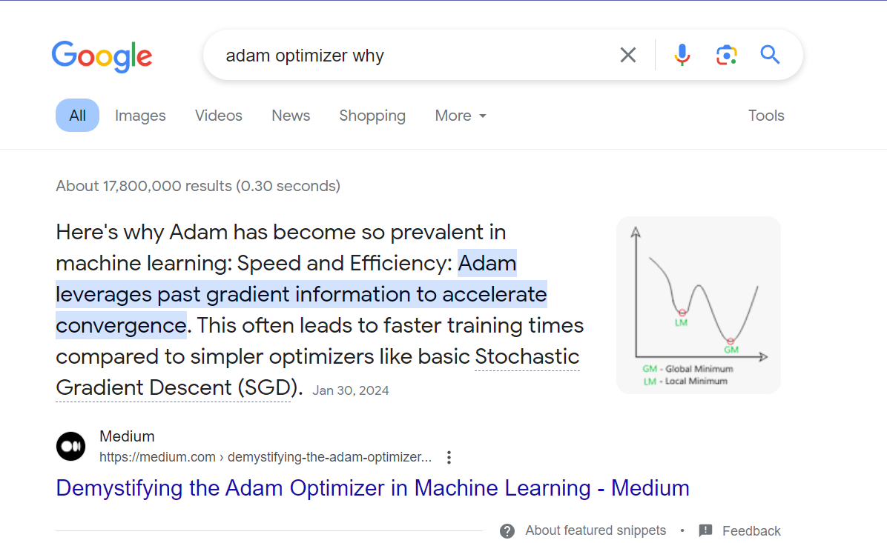
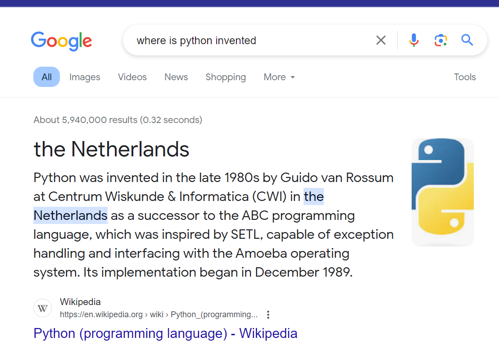
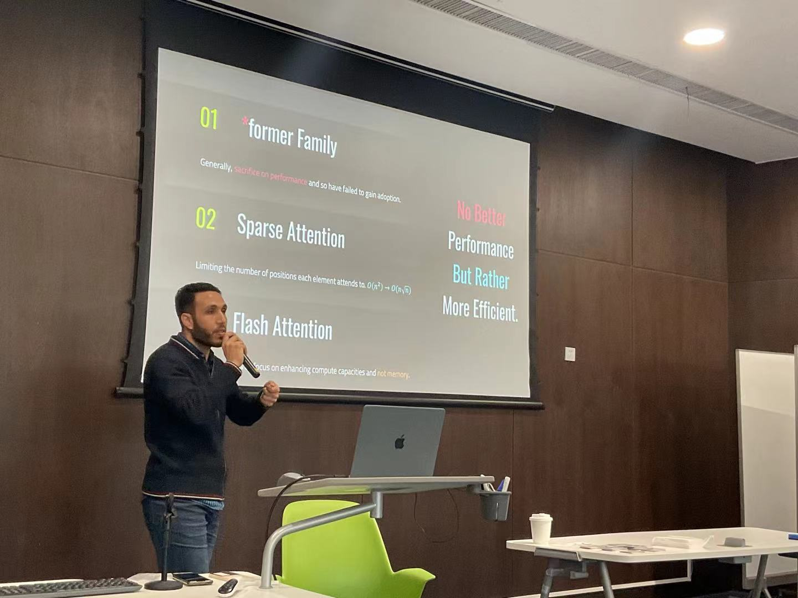
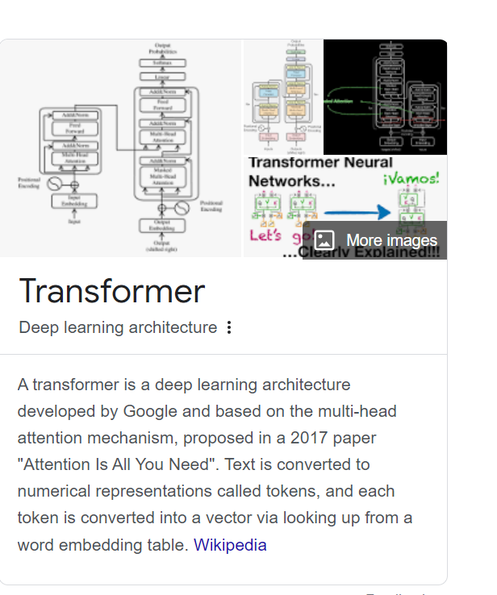
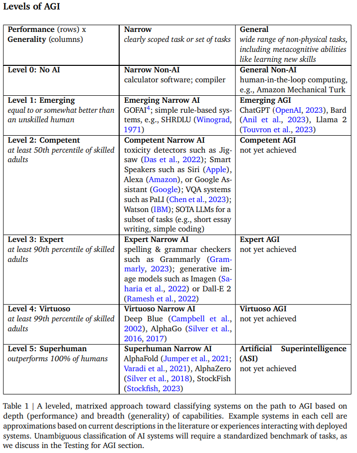
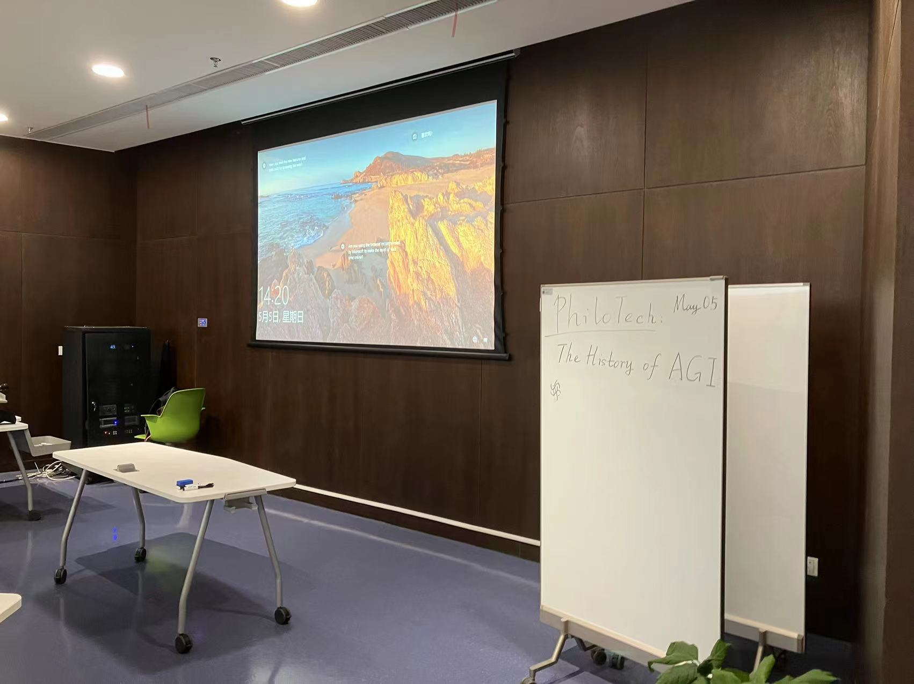

# PhiloTech Salon: The History and Future of Artificial General Intelligence(AGI)
<!--注释: 这次是沙龙不是工作坊，两个性质不一样 -->
- 2024.5.5

- Author: Wan Yuxiang

- Editor: Tong Wang

## Overview
Standing at the crossroads of the booming development of AI technology, we have witnessed both the successes and challenges in the past exploration of artificial intelligence. Embracing the acceleration of AI applications, we look forward to the blueprint of AGI.

In this regard, PhiloCoffee Club organized a technical salon themed ***"The History and Future of AGI"*** with coffee from WeLounge Cafe in the multi-function hall of the library.

## Introduction

At first, Tony Wang, the club president initiated our discussion on computer science and AI development.

Through this [guide](https://philocoffee.github.io/tech/2024/0505_PhiloTech_AGI/chm.html), we virtually visited Computer History Museum in California.

> [Computer History Museum Website](https://computerhistory.org/)

## The Interweaving Relationship Between Individual Educational Experiences and AI Development
Dr. Wei Wang, ZJUI 2023 Academic Advisor, shared his own educational experiences in the context of AI development.

He briefly introduced the history of AI development and then moved to his own journey. From Shandong province in China, through his studies at KTH Royal Institute of Technology in Sweden,  AI was a gradually popular topic, attracting countless scholars to devote their efforts.

The frequent teaching contents shifted from the K-nearest neighbor, Support Vector Machine, and Bag-of-Words model to a data-driven model, which reflected the rapid development of AI. 

Dr. Wang's academic journey continued with a doctorate at UvA in Amsterdam, where he insisted on his interest in AI applications despite high peer pressure. By the way, *the coffee shops in Amsterdam don't sell coffee, but drugs(don't buy it).*&#x1F602;  And Interestingly, the famous ADAM optimizer in Machine Learning may come from the '***AmsterDAM***', and besides Dr. Wang's lab, there locates the origins of Python.

Dr. Wang later shared his thoughts about AI in our WeChat group:

> *"I have always doubted the intelligence of current artificial intelligence and adhered to the concept of weak AI cuz many models are only fitting the distribution of data. But my views have been changing recently, inspired by the one typical insect(probably Sphex)that can make complex logical behaviors but later found that it is just repeating some non-conditional reflexes. does human emotion  belong to a complex advanced non-conditional reflex? Does the neuron of living animals follow the **"quantitative change**" to **"qualitative change"?"***    ---Dr. Wang

### Recommended Papers by Dr. Wang:

>- [KAN](./AGI.assets/2404.19756v2.pdf)
>- [Conditional DiffusionModel with Sparse Masked Modeling for Vision Decoding](./AGI.assets/Chen_Seeing_Beyond_the_Brain_Conditional_Diffusion_Model_With_Sparse_Masked_CVPR_2023_paper.pdf)
>- [All-optical machine learning using diffractive deep neural networks](./AGI.assets/science.aat8084.pdf)

## Academic Sharing on Cutting-edge AI Models

Dr. Khaled Alkilane, Postdoc Fellow at SURF (Smart Urban Future) Lab in ZJUI, shared insights on the latest AI models.

With an elegant PPT, He introduced various cutting-edge AI models, with a focus on the Transformer model, highlighting its significance in current AI research. His presentation included visualizations from 3Blue1Brown's animations, making complex concepts accessible.

> Dr. Khaled  emphatically introduced the Transformer model for its commanding position in current AI research and its derivatives. 
>
> We also caught a glimpse of multiple mechanisms and ideas behind them, including convolutional neural networks, attention mechanisms, and multi-head attention... 

Moreover, Dr. Khaled also pointed out the current balance between the performance and efficiency of current AI models. He claimed the current development level of AGI, stating that we are at Level 1: Emerging, with AI performing at or above the level of unskilled humans.

>**Recommended Materials**:
>
>[Visual Intro to Transformers](https://www.youtube.com/watch?v=wjZofJX0v4M)
>
>[Flashattention-fast-and-memory-efficient](https://paperswithcode.com/paper/flashattention-fast-and-memory-efficient)
>
>[Mamba-linear-time-sequence-modeling](https://paperswithcode.com/paper/mamba-linear-time-sequence-modeling-with)

## Reflection on the Current Development of AI

Prof. Said Mikki from ZJU-UIUC Institute, who specializes in the cross-disciplinary research about ethics, cognitive science, philosophy, and AI, shared his critical reflections on AI development. 

On the contrary to the optimistic ideas that massive data models and large computation will ultimately speed up the era of AGI, Prof. Said Mikki presented the minority view that ***"AGI must involve an incomputable process,"*** suggesting that AI development should consider the more abstract thinking processes of humans. 

His insights refresh our viewpoint of ongoing research trend in AGI. This highlights the importance of balancing technological advancements with philosophical and cognitive understanding.

### Discussion:

Supervised by Prof. Said Mikki, we discussed around the incommutability of the AI model. 

The author suggest that maybe we should introduce the probability cloud and allow more randomized processes and noise in AI. Maybe when we embrace the uncertainty we can truly build AGI.

Tony Wang and Steve Lin also noted that AI does not necessarily have to imitate the human thinking process and have interpretability.

> ***"Intelligence does not necessarily need to be conscious"*** --- Pro. Mark Hasegawa-Johnson at UIUC, Course Professor of ECE448: Artificial Intelligence 

## Our Action to Develop AGI: Personal Academic Work Sharing

Near the end, Mr. Ching-yuen Huang, a future Ph.D. student at Rutgers University, shared his recent academic work in LLM, data mining, and his future lab work.

**Research Opportunities**:

> 19级ECE李子豪学长 currently at UIUC pursuing a Ph.D. under Prof. Jingrui He, has published in top conferences and offers guidance in research opportunities. 
>
> Contact: violet24k@outlook.com

> 20级ECE黄靖元学长 will join Rutgers University for Ph.D. studies under Prof. Yongfeng Zhang, offering research opportunities in LLM, AI agents, and foundational models. 
>
> Contact: chy.huang@rutgers.edu

## Summary

Reviewing the development of AI and highlighting the educational and research harvests about AI on an individual basis, this fruitful technical salon deepened our understanding of AGI, while also involving critical reflections from philosophy and cognitive science. This fusion of technology and philosophy, complemented by a relaxed salon atmosphere with beverages like coffee, perfectly aligns with the mission of our club.

> **"At the intersection of philosophy and AI, we find the essence of human ingenuity."**
>
> --ChatGPT4O

