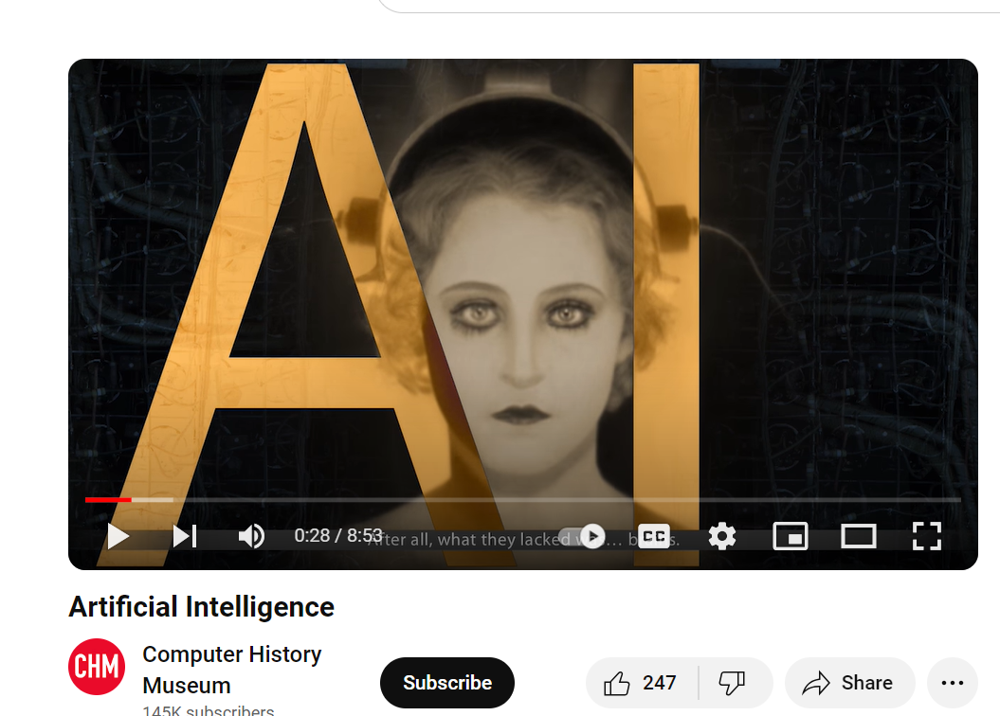

# Computer History Museum

- 4.7 / 5 star, [6,818 Google reviews](https://www.google.com/search?q=computer+history+museum&oq=computer+hist&gs_lcrp=EgZjaHJvbWUqCggAEAAYsQMYgAQyCggAEAAYsQMYgAQyCggBEAAYsQMYgAQyBggCEEUYOTIHCAMQABiABDIHCAQQABiABDIHCAUQABiABDIHCAYQABiABDIHCAcQABiABDIHCAgQABiABDIHCAkQABiABKgCALACAA&sourceid=chrome&ie=UTF-8&zx=1714838373597&no_sw_cr=1#) 
- Museum in Mountain View, California
- Website: http://www.computerhistory.org


## Intuition

My recent visit,..., compared to my younger time. 


> Visit and book ticket here: https://computerhistory.org/visit/


## Hardware

https://www.computerhistory.org/revolution/birth-of-the-computer/4/78


https://computerhistory.org/events/the-chinese-computer/

## Software


https://info.computerhistory.org/apple-lisa-code


https://computerhistory.org/exhibits/make-software/


## Artificial Intelligence

- Data security
- https://computerhistory.org/events/nova-secrets-in-your-data/

- Digital Twin: Minecraft Education Version

https://22740101.fs1.hubspotusercontent-na1.net/hubfs/22740101/Education/chm-minecraft-educator.pdf




https://www.youtube.com/watch?v=NGZx5GAUPys


## Wait, Why not just ask AI directly?

> Prompt:
>
> 

```
Tell me the history of Artificial General Intelligence.
```


```
Tell me again using tree structure. 
```


```
Explain AGI and its connection to the Free will
```


