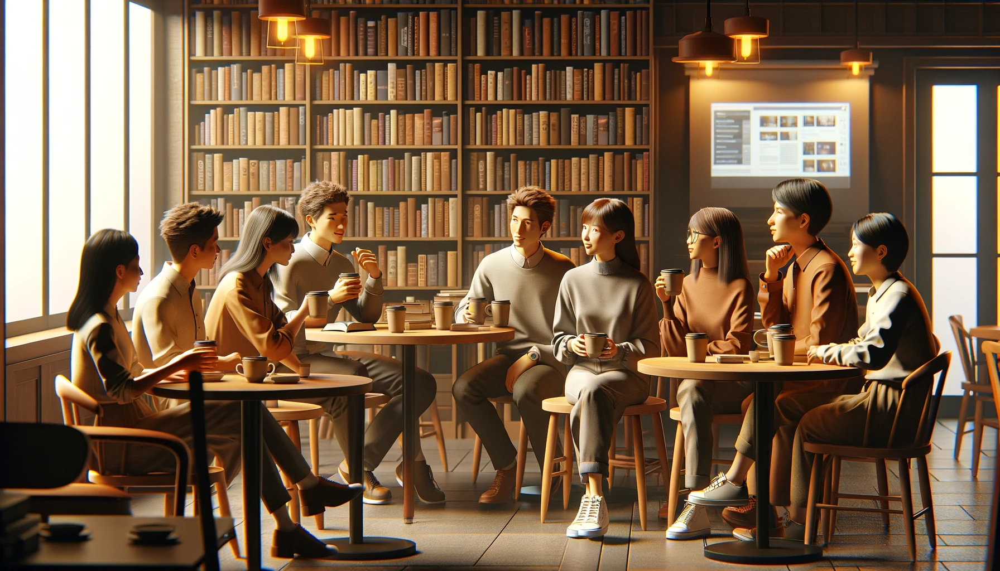
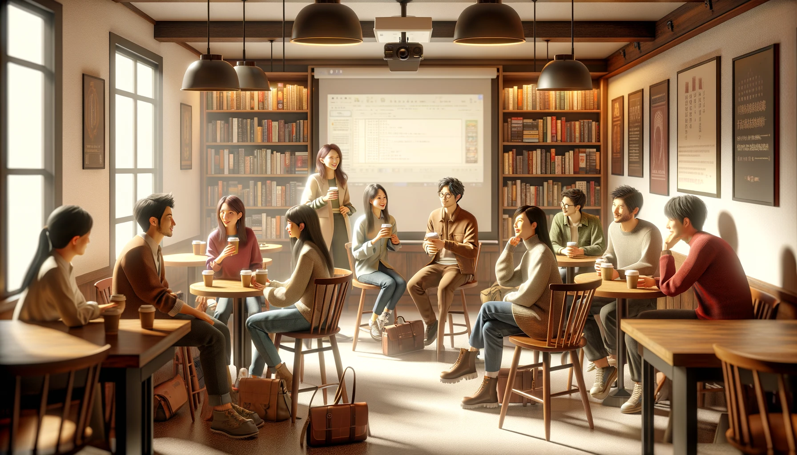

# PhiloTech Salon on the History of Artificial General Intelligence

- **Date: May 5** 

- **Time:** 14：30-16：30

- **Location:** Multi-function hall on the first floor of the Library(图书馆一楼多功能厅), Intl Campus, ZJU

- **Host:** Mr. Tony Wang, Incoming Master of Electrical Engineering from UPenn, President of PhiloCoffee Club

- **Special Guest:** 

    - **Prof. Said Mikki** at ZJU-UIUC Institute, Ph.D in Electrical Engineering from University of Mississippi
    - **Dr. Wei Wang**, Ph.D in Computer Science(AI) from University of Amsterdam, ZJUI 2023 Academic Advisor 
    - **Dr. Khaled Alkilane**, Ph.D in Computer Science from Dalian University of Technology
    - **Mr. Ching-yuen Huang**, Incoming Ph.D. in Computer Science from Rutgers University
    - More upcoming PhD...

    

- **Details:** 

    **PhiloTech** is honored to invite Dr. Wei Wang, a distinguished returnee from the University of Amsterdam with extensive experience in AI and computer vision research. Dr.  Wei Wang is also our beloved advisor for the ZJUI Class of 2023. Additionally, several senior undergraduates and *Ph.D.* students will share their research experiences at this salon. Prof. Said Mikki, renowned for his wisdom in the philosophy of technology, will also participate in the salon. On May 5th, at the end of Labor Day, join us to explore how, in this era of rapid AI development, we as university students can position ourselves and grasp the future.

> PhiloTech沙龙非常荣幸邀请到王威博士。作为阿姆斯特丹大学归国的杰出学者，王导拥有丰富的人工智能和计算机视觉研究经验。同时，他也是我们亲爱的辅导员，指导ZJUI2023 级同学们的成长。在沙龙还邀请几位资深本科生和博士研究生分享他们的研究经历。届时，在科技哲学颇有著述的Said Mikki教授也会出席参与沙龙。5月5日，在劳动节的尾巴，欢迎大家来一同探讨在人工智能迅速发展的时代，我们作为大学生如何规划未来。 

## Outline

#### Introduction (14:30 - 14:45)
- **Welcome and Purpose**: Brief introduction to the salon's goals.
- **Speaker Introductions**: Quick highlights of each guest's expertise.

#### Session 1: Historical Perspectives (14:45 - 15:15)
- **Presentation by Tony Wang**: Insights from the Computer History Museum with images.
- **Discussion**: Key historical developments in AI.

#### Session 2: AI Trends and Future (15:15 - 15:45)
- **Talk by Dr. Wei Wang**: Evolution and current trends in computer vision.
- **Talk by Dr. Khaled Alkilane**: "Transformer" as the most important breakthrough in AI ever.

#### Break and Networking (15:45 - 16:00)
- **Intermission**: Refreshments and informal discussions.

#### Session 3: Panel Discussion (16:00 - 16:25)
- **Supervision by Prof. Said Mikki**: Philosophical implications of AGI.
- **Q&A**: Audience interaction with the speakers.

#### Closing Remarks (16:25 - 16:30)
- **Summary and Thanks**: Recap and appreciation.
- **Call to Action**: Promote further engagement with club activities.

