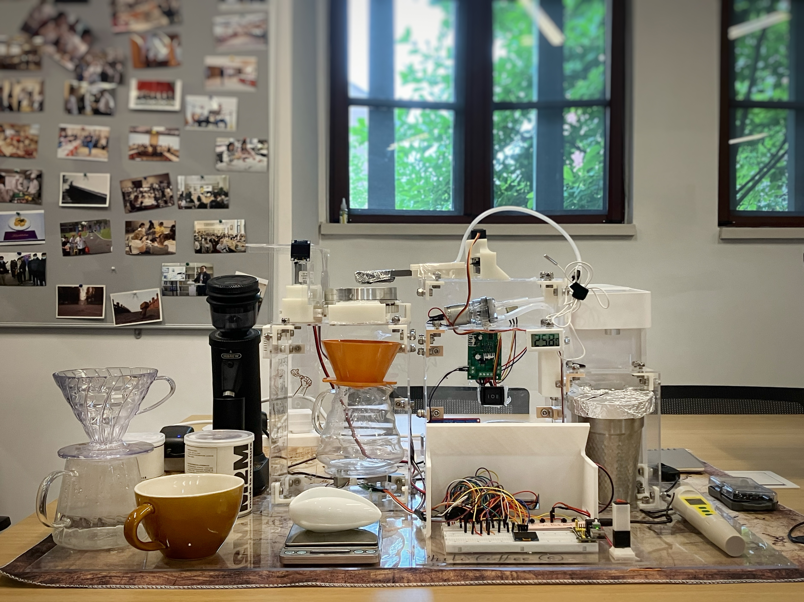
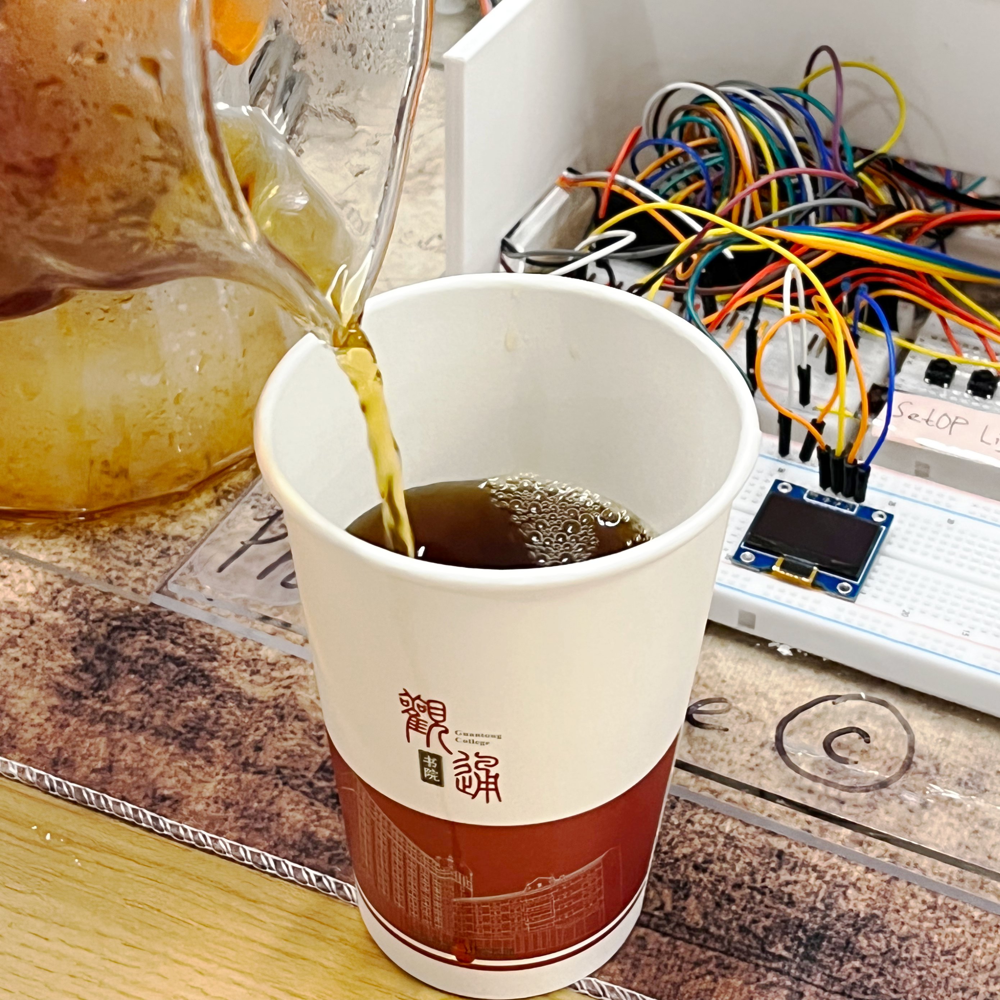

### **Subject: PhiloCoffee | Our Intelligent Brew Coffee Machine in Senior Design Exhibition Day Today!**

**Dear PhiloCoffee Club Members,**

Happy summer holiday! I hope you thrive in the past final weeks. 

On May 5th, we held a small salon on AGI named *The History and Future of Artificial General Intelligence(AGI)*. Inviting students of ZJUI sharing their perspectives of AGI, Prof. Said Mikki also attended to supervise our discussion. 

Here is the event blog by Wan Yuxiang:  [2024/0505_PhiloTech_AGI/Blog](https://philocoffee.github.io/tech/2024/0505_PhiloTech_AGI/AGI.html)

Now, as our graduation approaching, I would like to invite you to see our club’s latest tech project — ***the Intelligent Pour-Over Coffee Machine.*** 

This isn't just any coffee machine; it's a complex device designed to mimic the expertise of a professional barista, providing you with a cup of ‘Machine-Brewed Pour Over Coffee’.

Our group's senior design Final Report is now available here [ECE445/ME470: Senior Design Final Report #15](https://courses.grainger.illinois.edu/ece445zjui/getfile.asp?id=23789) 

Welcome to have a try on our machine tomorrow, at the DEMO day. All ZJUIers' senior design will show up in the exhibition. Have some fun watching two-legged wheel robots, T-shirt Launcher III, bird-watching telescope, and IC Card Dispenser for our residential college!

**Date:** **June 1
** **Time:** **9:30 ~ 11:30 (with possible face-to-face demo)
** **Venue:** **Multi-functional Hall of­­ Guangtong College**

**Event Details:** **Senior Design Exhibition**

☕During the demo, you'll get to see the machine in action, learn about its innovative features, and of course, taste the coffee it produces. We will provide a short user survey for anyone trying our machine, for free!

🧑‍🤝‍🧑Whether you're a coffee fan or a tech enthusiast, there's something for everyone to enjoy during the senior design exhibition.

🎉There will be more events coming this summer. Looking forward to seeing you there and sharing a cup of coffee together!

Warm regards,

Tony Wang
President, PhiloCoffee Club
***ZJU-UIUC Institute***

 